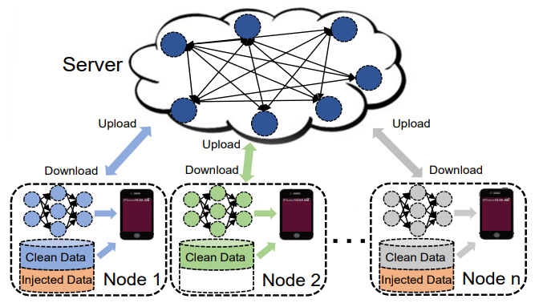

When attacking a neural network we have two options when we want to carry out our attack:

1. During training ➡️ Directly influence the training data of the model
2. During usage ➡️ Fool the model with specific inputs or try to retrieve hidden information from the model

# Attacks During Training

We have multiple possibilities to change the training data in a malicious way.

## Data Poisoning

In data poisoning we intentionally add incorrectly labeled data to our training. We can for example do this in a very obvious way such that the model will not work properly when trained. However, users and developers will recognize this quickly.

We also have the option to only add a small number of wrong data points. This way we can decrease the accuracy of the model without anyone noticing that the actual accuracy of the model could be higher.

Data poisoning can for example be used in [Federated Learning](Deep Learning Concepts/Federated Learning.md). Here we poison the training data on one of our client devices. The weights of the fine-tuned model which the server will use are then compromised.

---

*Backdoor Attack on Federated Learning ([Source](https://arxiv.org/abs/2004.10020))*

---

## Backdoor Attacks

These types of attacks are way mroe subtle than data poisoning attacks. Here we only add a few faulty training examples that will definitely go unnoticed. The idea is the following:

- Backdoor attacks do not affect the overall performance of the model
- We add carefully crafted examples that give us an unexpected behaviour of the model in a very specific edge case. Only we as an attacker know about this edge case

**Example**: We have an access-management system that visually recognizes people who are allowed to enter. We can do a backdoor-attack in such a way that when wearing a specific pair of glasses, every person is granted access. We do this by adding a few training examples with different people waring these glasses. It does not affect the overall performance of the model, but gives us a secret way to trick the model.

# Attacks During Usage

## Adversarial Attacks