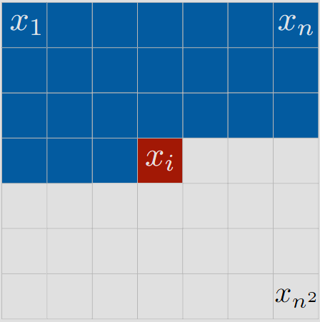

>  Originally written in German. Translated from English to German using ChatGPT due to laziness

PixelRNN stands for *Pixel Recurrent Neural Network*. This type of model was developed in 2016. These networks explicitly rely on maximizing the maximum likelihood estimation of $\hat{p}(x)$ for each pixel. Thus, they can not only generate samples from the approximated distribution of the training data but also explicitly model the distribution. This is in contrast to GANs.

The following explains how a PixelRNN determines the optimal value for each pixel of a generated image. An image $x$ with resolution $\mathrm{n}\times \mathrm{n}$ can be divided into its individual pixels $(x_1, x_2, ..., x_{n{^2}})$. The following equation shows how the probability of each pixel contributes to the overall distribution $\hat{p}(x)$.

$$
\hat{p}(x) = \hat{p}(x_1, x_2, ..., x_{n^2}) = \prod_{i=1}^{n^2} \hat{p}(x_i|x_1, ..., x_{i-1})
$$

In principle, we simply apply the chain rule of probability to $\hat{p}(x_1, x_2, ..., x_{n^2})$.

This results in a central idea. We start the generation in one corner of the image. The image is initially reduced to one pixel, which is called $x_1$. The PixelRNN generates a value for this pixel. Then, $x_1$ is considered together with a neighboring pixel $x_2$. The probability distribution for $x_2$ is then $\hat{p}(x_2|x_1)$. The value for $x_2$ thus depends only on $x_1$. Since $x_1$ is known, the PixelRNN can determine an optimal value for $x_2$. The probability distribution for $x_3$ is $\hat{p}(x_3|x_2, x_1)$, and for $x_4$ it is $\hat{p}(x_4|x_3,x_2,x_1)$. The PixelRNN generates the image successively, with the current pixel value for $x_i$ depending on all previously generated pixels. This process is shown in the following figure. The value of the red-marked pixel depends on all the blue-marked pixels. Once a value is determined for this pixel, the pixel to the right is chosen as the new $x_i$.

---

*Visualization of the successive generation of a PixelRNN ([Source](https://arxiv.org/abs/1601.06759))*

---

To model the dependency of a pixel $x_i$ on the previously generated pixels, PixelRNN is a Recurrent Neural Network. For generating $x_i$, the state of the network during the generation of $x_{i-1}$ is crucial.

This method also has similarities to Gibbs Sampling.

# Advantages

Since the distribution $\hat{p}(x)$ implemented by a PixelRNN is directly measurable, it is said that the performance of such networks can be well evaluated. It is considered relatively easy to implement metrics for measuring the performance of such networks.

# Disadvantages

A fundamental disadvantage of PixelRNNs is that they can only generate images sequentially. In the described procedure, it is not possible to generate multiple pixels in parallel, as the value of one pixel depends on all previously generated pixels. This slows down the generation process since no parallelization is possible.

There are also so-called PixelCNNs, where the calculation always focuses on specific image areas. These image areas can be computed in parallel by the PixelCNN. However, parallelization is only possible during network training or during the evaluation of $\hat{p}(x)$ for given images. The image generation, similar to PixelRNNs, is entirely sequential.

# Sources

[Pixel Recurrent Neural Networks](https://arxiv.org/abs/1601.06759)
