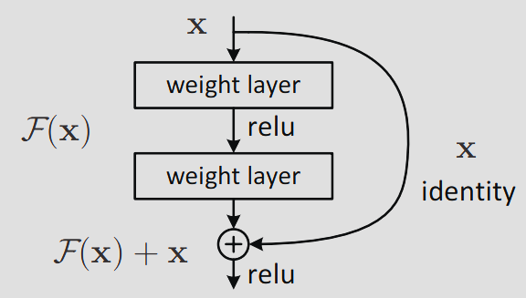
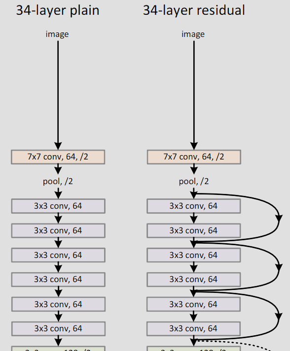

> Originally written in German. Translated from English to German using ChatGPT due to laziness

# Problem Statement

The more complex the problem to be solved, the more deeper network architectures are typically used. However, this has two problems.

1. Deeper architectures generally have more parameters and are therefore more prone to overfitting.
2. Deep neural networks are computationally more intensive.

# Proposed Solution

ResNet aims to simulate a less complex architecture within a complex network architecture.

For this purpose, ResNet uses *Residual Blocks.* There are two paths: One path feeds the input through multiple layers; the other path passes the input unchanged. The output of the *Residual Block* is the sum of these two paths.

---

*Residual Block*

---

The following figure shows a section of a complete ResNet architecture. Packages of two *Convolutional Layers* are each skipped by an additional path.

---

---

This approach also solves the Vanishing Gradient Problem.

# References

[Deep Residual Learning for Image Recognition](https://arxiv.org/abs/1512.03385)

[Understanding and visualizing ResNets](https://towardsdatascience.com/understanding-and-visualizing-resnets-442284831be8)

[ResNets: Why do they perform better than Classic ConvNets? (Conceptual Analysis)](https://towardsdatascience.com/resnets-why-do-they-perform-better-than-classic-convnets-conceptual-analysis-6a9c82e06e53)
