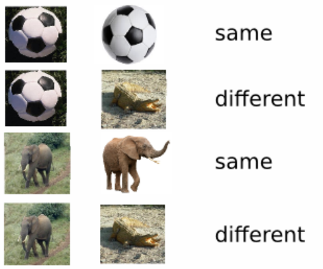

One-shot Learning refers to the idea that we want neural network to learn a new task with only a single example. For One-Shot classification we can for example use siamese networks.

# Siamese Networks

Suppose we want to use a model to classify images of a new class. In this approach we take a neural network trained on the ImageNet dataset. We remove the classification head and only look at the embeddings produced by the last hidden layer.

We then take our single example of the new class. For example an image of the type “polar bear”. This is our only training image. We feed this image into the model and observe the logit output of our model.

Then, in a next step we take our query image for which we would like to know whether it shows a polar bear. We also feed it into the model and observe the outputs.

Lastly, we the compare the embeddings produced by the two images. We can expect that they are similar if both images show the same class. We feed those embeddings into a single neural network layer and get a binary output whether the embeddings belong to the same output class. This layer has to be trained. Our Siamese Network is finished.

We can also just directly compute the cosine similarity between the outputs and apply a threshold. Then we have to fine-tune our model such that the classes can clearly be distinguished by the cosine similarity of their embeddings.

---

*Siamese Network where a dog image is compared to the image of a cat. The fully connected layer (FC layer) outputs the respective embeddings. Here there is no classification layer used that decides whether the embeddings correspond to the same class. Instead a similarity score is directly computed (such as a cosine similarity). ([Source](https://www.researchgate.net/figure/Architecture-of-Siamese-network-for-patch-based-feature-extraction-and-training_fig1_334964730))*

---

*Results obtained by using a Siamese Network. Network tells us whether the two images show the same class. (Source: G. Koch et. al, Siamese Neural Networks for One-shot Image Recognition, 2015)*

---