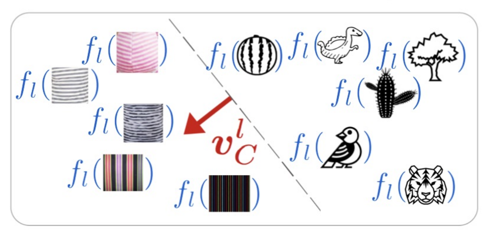

# General

- TCAV provides explanations that can be understood by non-technical people
- Is more on the end-user side than for example LIME which only explains singe predictions
- TCAV = Testing with Concept Activation Vectors
- Can explain whole classes instead of only single predictions
- TCAV learns concepts -> Not only classes
  - Concepts must not explicitly be labeled, TCAV can learn these concepts
  - We can use these concepts to determine biases in our model/dataset

# Motivation

# Related Work

## Saliency Maps

- Many popular XAI methods employ soliency maps
- These should tell a human which features contributed most to the given answer
- The authors of the paper argue that these saliency maps are not very robust
  - If we randomize the last layers of a neural net, the saliency map often stays the same -> But the predictions are completely random
  - Means that a human could for example not infer from this why the predictions are bad -> saliency map looks plausible
- Saliency maps require human judgement to explain the predictions of the model -> But, this is no quantitative measure and humans suffer from confirmation bias (we especially look for evidence that underpins our inital hypothesis)

## Arguments of the Paper against Current Approaches

- What we are actually interested in is to see which concepts in an image are most important for the predictions
  - E.g. was a person or a specific object most important for making the prediction? Or: Did the model pay addention to the persons gender
- Many common interpretability methods assess the importance of individual features
- The main problem is that the model internally defines concepts differently than how humans do
  - NNs define them in their internal latent space -> not interpretable by humans
  - Humans have an entirely different way of thinking about concepts
  - We need a way to merge these two

# Approach

The goal of TCAV is to assign a score to each concept for every prediction of our model. This way we can see how import this concept was for our prediction. There are several steps we need to take in order to obtain a concept score for a given training image.

## 1. Step: Compute concept activation vector

Suppose we want to see whether stripes is an imporant concept for the classification of images as "zebra" or "no zebra". We need a dataset that contains images with stripes (any kinds of stripes) and also random images that show something else than stripes.

We then feed these images into our model. It is important that we select an intermediate layer where we observe the outputs. We basically look into the latent space of our model.

We train a linear classifier on the activations of this intermediate layer. The vector perpendicular to the decision boundary is our concept activation vector (CAV).

---

*CAV for the classification of stripes/non-stripes activations*

---

## 2. Step: Let model make a prediction

Then we feed a normal image from our original zebra dataset into the model. Again, we observe the output of the same intermediate layer.

## 3. Step: Compute score of the prediction for the previously learned concept

$$
S_{C,k,l}(\textbf{x}) = \nabla_{\textbf{V}_C^l}h_{l,k}(f_l(\textbf{x})) = \nabla h_{l,k}(f_l(\textbf{x}))\cdot \textbf{v}^{l}_{C}
$$

Whereas $h_{l,k}$ is the prediction of our model if our activations in layer $l$ have a specific value. And $\textbf{v}_C^l$ is the concept activation vector. $S_{C,k,l}$ is the directional derivative of $h$ with respect to the CAV $\textbf{v}$. We basically ask ourselves the following question: If we artificially tell our model that in layer $l$ the concept is more present or less present than what it would usually say, how does this affect the output of the model?

If the output is not affected this, it means that this concept does not have a high importance for our prediction. If the output changes significantly, we know that our model values this concept as important information for its prediction.

## 4. Step: Compute score in range [0, 1] for individual classes

$$
\textrm{TCAVQ}_{C,k,l} = \frac{|\{\textbf{x}\in X_k: S_{C,k,l}(\textbf{x}>0)\}|}{|X_k|}
$$

# Results

# Discussion

# References

[Interpretability Beyond Feature Attribution (youtube.com)](https://www.youtube.com/watch?v=Ff-Dx79QEEY)

[Explainable AI with TCAV (youtube.com)](https://www.youtube.com/watch?v=GLLRqAjC_OY)

[Interpretability Beyond Feature Attribution: Quantitative Testing with Concept Activation Vectors (TCAV)](https://arxiv.org/abs/1711.11279)

[Quantitative Testing with Concept Activation Vectors (TCAV) -- Been Kim (Google) - 2018 (youtube.com)](https://www.youtube.com/watch?v=wBcrPDPUTrE)